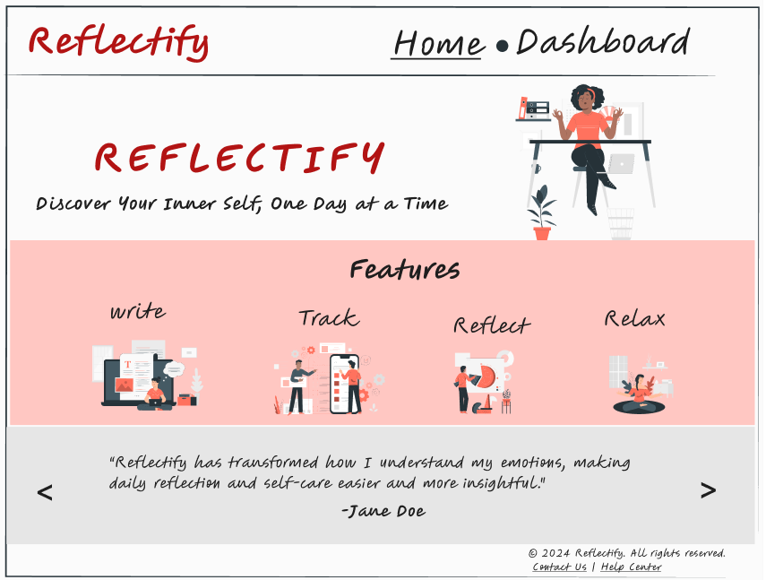
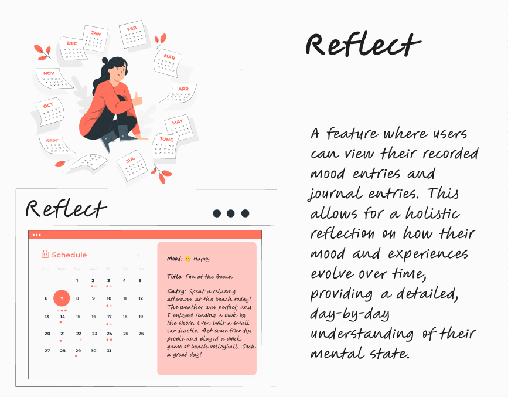
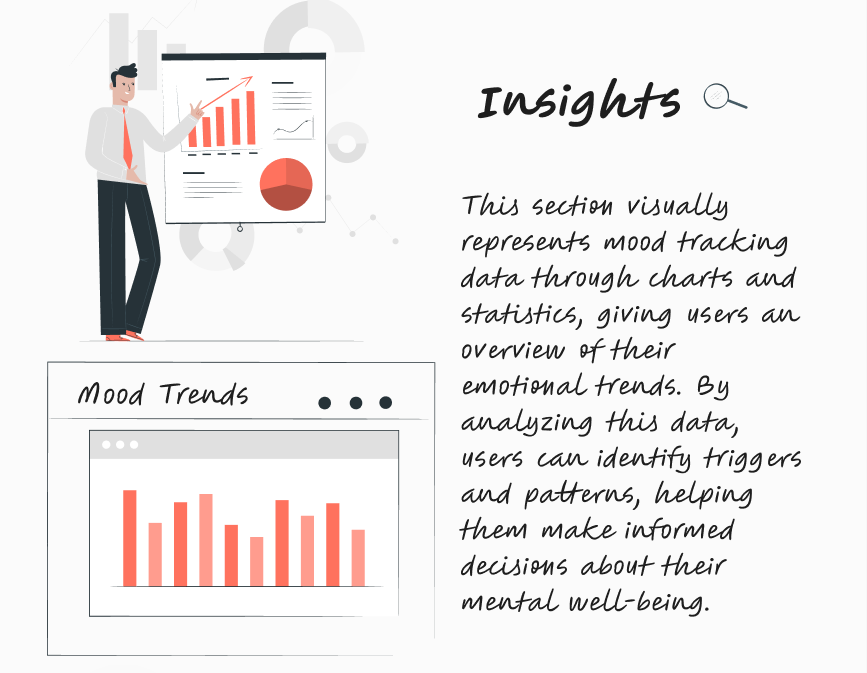
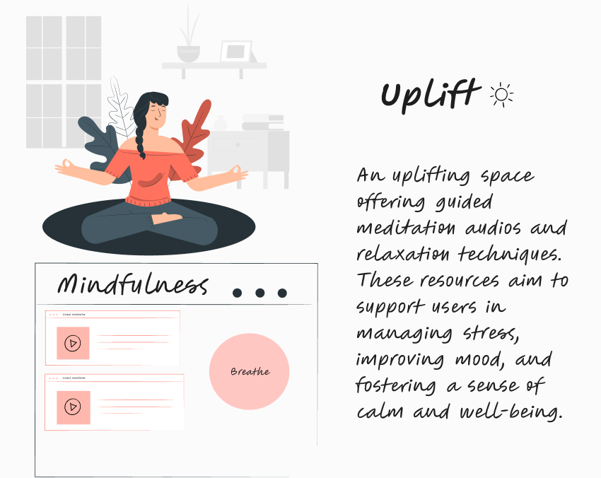

# Project Title

## Reflectify: _Discover Your Inner Self, One Day at a Time_

## Overview

Reflectify is a web application that helps users track their daily moods, write journal entries, view insights, and engage in activities to uplift their emotions. By selecting emojis to represent their mood and recording daily reflections, users can gain a deeper understanding of their emotional well-being and access personalized content to support their mental health journey.

### Problem Space

In today's fast-paced world, mental health is becoming increasingly important. Many people struggle to keep track of their emotional well-being, often neglecting their mental health due to busy schedules or a lack of awareness. This application is needed to provide a simple and effective way for users to monitor their moods, understand emotional patterns, and take proactive steps towards maintaining a balanced state of mind.

### User Profile

- Target Users:
    - Individuals who are interested in monitoring and improving their mental well-being.
    - People who enjoy journaling and reflecting on their day-to-day experiences.
    - Users who seek mindfulness practices, like meditation, to manage stress and anxiety.

### Features
- Track Mood:
    - As a user, I want to select an emoji that represents my current mood so that I can quickly track how I feel each day.
- Write Journal
    - As a user, I want to write daily journal entries about my thoughts and experiences so that I can reflect on my day and express my emotions.
- View Insights
    - As a user, I want to see charts and statistics of my mood patterns so that I can identify emotional trends and triggers over time.
- Daily View/Reflect
    - As a user, I want to view my daily mood and journal entries on a calendar so that I can reflect on how my emotions have changed.
- Uplift
    - As a user, I want access to guided meditation audios and relaxation techniques so that I can improve my mood and manage stress effectively.        

## Implementation

### Tech Stack

- React
- JavaScript
- MySQL
- Express
- Client libraries: 
    - react
    - react-router
    - axios
    - Bootstrap
- Server libraries:
    - knex
    - express

### APIs

- No external APIs will be used for the first sprint

### Sitemap

- Home Page: Introduction to the app with link to dashboard.
- Dashboard: Navigation bar on home page to access all features (Track Mood, Write Journal, View Insights, Daily View/Reflect, Uplift).
- Track Mood: Page where users select an emoji representing their current mood.
- Write Journal: Simple text input for users to write daily journal entries.
- View Insights: Charts and statistics visualizing mood patterns over time.
- Daily View/Reflect: using Calendar/ Date picker showing mood and journal entries for each day.
- Uplift: Page offering guided meditation audios and relaxation techniques.

### Mockups

#### Home Page

#### Dashboard

#### Track Mood Page

#### Write Journal Page

#### Reflect Page

#### Insights Page

#### Uplift Page

### Data

#### SQL Schema

### Endpoints

**POST /moods**
 Saves the mood for a specific date.
- Parameters: userID, mood, date
- Response: success message(201) or error

**GET /moods/id?date=date**
 Get the mood entry for user for a specific date.
- Parameters: Date
- Response:
success-
 {
    "id": 1,
    "user_id": 3,
    "mood": "good",
    "timestamp": "2024-09-02T11:30:00.000Z"
}
error-
400- Date query parameter not provided
500- Server Error

**GET /journal/id?date=date**
 Get the journal entries for user for a specific date.
- Parameters: Date
- Response: 
success-
 {
    "id": 1,
    "user_id": 1,
    "title": "Morning Reflections",
    "content": "Had a peaceful morning. Feeling optimistic about the day. The birds were chirping, and the cool breeze made me feel refreshed. I hope to carry this calm energy into the rest of the day.",
    "timestamp": "2024-09-02T11:30:00.000Z"
}
error-
400- Date query parameter not provided
500- Server Error

**POST /journal**
 creates the journal entry.
- Parameters:  userID, title, content, date
- Response: success message(201) or error

## Roadmap

- Create client
    - react project with routes and boilerplate pages

- Create server
    - express project with routing  

- Deploy client and server projects so all commits will be reflected in production.

- Implement database setup, Create seeds with sample moods and journal.

- Feature: Home Page
    - Implement Home Page 
    - Add Header and Footer

- Feature: Dashboard
    - Implement Dashboard
    
- Feature: Track Mood
    - Implement Track Mood page 
    - Create POST / mood endpoint

- Feature: Write Journal
    - Implement Write Journal page and add form validations. 
    - Create POST / journal endpoint

- Feature: Reflect
    - Implement Daily View/Reflect Page.  
    - Create GET / journal endpoint
    - Create GET / mood endpoint

- Feature: Uplift
    - Implement uplift page
    - add audios from sound cloud and animations.  

- Feature: Insights
    - Implement Insights page 
    - Integrate data visualization for insights using library like Chart.js.

- Testing, debugging, and UI/UX improvements.

- Bug fixes

- DEMO DAY

## Future Implementations
- Login Feature
- Authentication
- Email Notifications/ Reminders
- Social Sharing: Allow users to share their mood insights or journal entries with selected friends or support groups.
- Goal setting and activity tracker.
- Mood Analysis: Incorporate AI to analyze journal entries for mood patterns and provide personalized feedback.